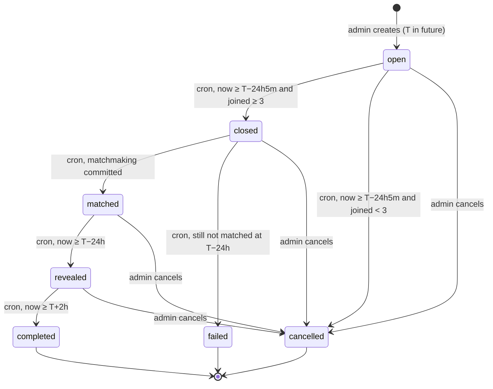
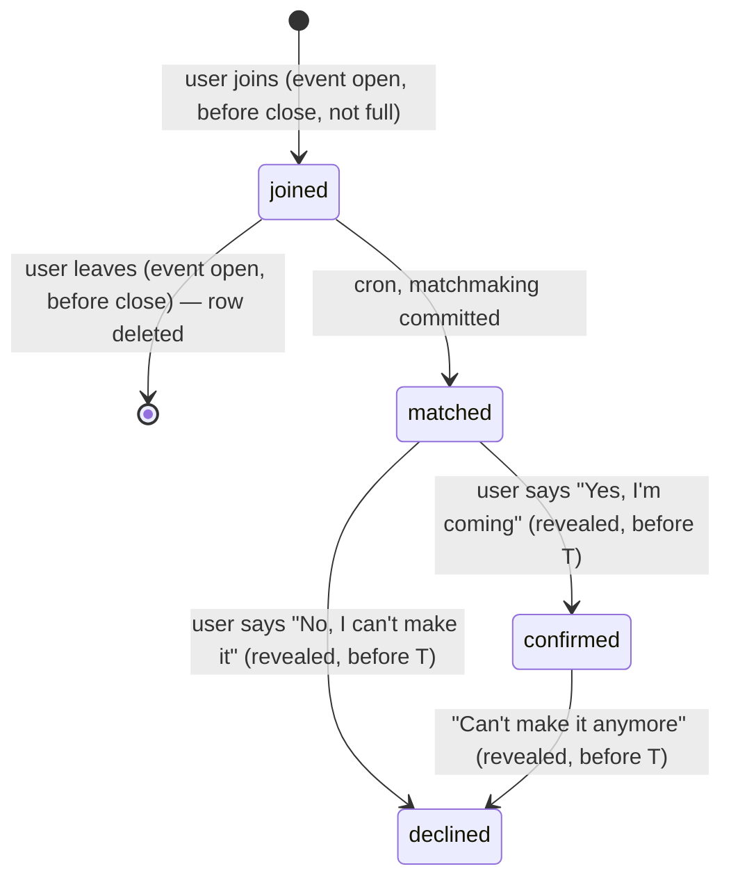

# Koffito event and matchmaking flow

This document describes the **target** flow for creating, joining, matching, revealing and rating a
coffee talk, and how to test it end to end.

> **Status (2026-09-25).** Implemented in Supabase (migrations `koffito_v7_01`…`v7_04`), the
> FastAPI backend and this app. Section 7 maps each rule to where it lives. Section 8 explains how
> to test it, including the automated end-to-end script `../Koffito-Backend/scripts/e2e-flow.sh`.

Related docs:

- [`frontend-integration.md`](./frontend-integration.md): the current API contract used by the app.
- Backend repo (`../Koffito-Backend`): `docs/api.md`, `docs/database.md`, `docs/development.md`.

---

## Contents

1. [Overview](#1-overview)
2. [Fixed rules](#2-fixed-rules)
3. [State machines](#3-state-machines)
4. [Step-by-step flow](#4-step-by-step-flow)
5. [Matchmaking algorithm](#5-matchmaking-algorithm)
6. [Security and data visibility](#6-security-and-data-visibility)
7. [Implementation status (gap analysis)](#7-implementation-status-gap-analysis)
8. [How to test](#8-how-to-test)
9. [Copy strings](#9-copy-strings)

---

## 1. Overview

An admin picks **only a date and time** for a coffee talk. Users join it blind: they see the time,
but not the café, the other people, or how many people have joined. Registration closes a little
over a day before the event. A server-side job then splits everyone into groups of **3–5** people
by shared interests and gives each group its own café. At **T − 24h** the groups are revealed.
Each user must say whether they are coming before they can see their café and group. Two hours
after the start, the event is completed and users can rate it and report participants.

The admin never approves or edits groups. After creating the event, the admin only watches,
manages cafés, and can cancel.

Everything time-based happens in **one scheduled job** (Supabase Cron, every minute). Nobody,
not even the admin, triggers a status change by hand, except cancelling.

---

## 2. Fixed rules

| Rule                | Value                       | Notes                                                                         |
| ------------------- | --------------------------- | ----------------------------------------------------------------------------- |
| Group size          | **3–5 people**              | Preset for every event. Shown to the admin read-only, never stored per event. |
| Event time          | `T`                         | The only input the admin gives. Must be in the future.                        |
| Registration closes | `T − 24h 5min`              | Joins and leaves are rejected from this moment on.                            |
| Reveal              | `T − 24h`                   | Users can open the event and confirm or decline.                              |
| Completed           | `T + 2h`                    | Rating and reporting open.                                                    |
| Capacity            | `active cafés × 5`          | When reached, joining is blocked ("Event full"). Replaces the old waitlist.   |
| Minimum turnout     | 3                           | Fewer than 3 joined at close → event is **cancelled automatically**.          |
| Café per group      | 1, unique per event         | A café is never given to two groups of the same event.                        |
| Scheduler           | Supabase Cron, every minute | Runs all transitions and matchmaking with elevated privileges.                |

**Why there is no waitlist.** With groups of 3–5, any N ≥ 3 can be split into valid groups (see
section 5). The only way to be left out would be "not enough cafés", and the capacity rule
blocks that at join time.

### Worked timeline

Event created for **Saturday 2026-10-10 18:00** (local time):

| Moment              | Time                            | Event status after                        |
| ------------------- | ------------------------------- | ----------------------------------------- |
| Created             | any time before close           | `open`                                    |
| Registration closes | Fri 2026-10-09 **17:55**        | `closed` (or `cancelled` if < 3 joined)   |
| Matchmaking         | Fri 17:55–18:00, next cron runs | `matched`                                 |
| Reveal              | Fri 2026-10-09 **18:00**        | `revealed`                                |
| Event starts        | Sat 2026-10-10 18:00            | `revealed` (confirm/decline now rejected) |
| Completed           | Sat 2026-10-10 **20:00**        | `completed`                               |

The 5-minute window between close and reveal is the matchmaking budget. With a cron that runs
every minute, the job gets about five attempts before the event is marked `failed`.

### Storage

The admin only sets `event_at`. The trigger `set_event_times` re-derives
`registration_closes_at`, `reveal_at` and `completes_at` on every insert or update of those
columns, so they can never drift, and shifting `event_at` shifts the whole timeline
(section 8.3). Generated columns can't be used because `timestamptz ± interval` isn't immutable.
All offsets are exact elapsed time: on a daylight-saving change day, "24 hours before" is not the
same wall-clock time the day before.

---

## 3. State machines

### 3.1 Event status



| Status      | Meaning                                                  | Visible in "Find coffee talk" | Who moves it on |
| ----------- | -------------------------------------------------------- | ----------------------------- | --------------- |
| `open`      | Users can join and leave.                                | Yes                           | Cron            |
| `closed`    | Registration closed, matchmaking running.                | No                            | Cron            |
| `matched`   | Groups and cafés saved. Details still locked.            | No                            | Cron            |
| `revealed`  | Users can confirm or decline and see details.            | No                            | Cron            |
| `completed` | Event is over. Rating and reports open.                  | No                            | – (final)       |
| `failed`    | Matchmaking did not succeed before the reveal.           | No                            | – (final)       |
| `cancelled` | Cancelled by the admin, or automatically for < 3 people. | No                            | – (final)       |

Only the admin's cancel action and the cron job may change an event's status. Admin cancel is
allowed from `open`, `closed`, `matched` and `revealed`, never from a final state.

### 3.2 Participant status



| Status      | Meaning                           | Shown to groupmates as |
| ----------- | --------------------------------- | ---------------------- |
| `joined`    | In the event, not yet in a group. | –                      |
| `matched`   | In a group, hasn't answered yet.  | "Not confirmed yet"    |
| `confirmed` | Said yes after the reveal.        | "Confirmed"            |
| `declined`  | Said no after the reveal.         | "Declined"             |

There is no `waitlisted` status. When an event is cancelled, participant rows keep their last
status; the event status is what the UI reads.

**Changing your mind.** A confirmed user can still back out with "Can't make it anymore"
(`confirmed → declined`) until the coffee talk starts, so the rest of the group sees it.
A declined answer is final.

---

## 4. Step-by-step flow

Error codes are raised by name in the Postgres functions and mapped to HTTP statuses in
`../Koffito-Backend/src/koffito/supabase/errors.py`. All errors use the envelope
`{"error": {"code", "message", "details"?}}`.

### Step 1 — Admin creates the event

**Admin**

1. On the events list, the admin taps **Create event**.
2. The dialog has two inputs: **date** and **time**.
3. Under the inputs, read-only info updates live:
   - Group size: **3–5 people (preset)**
   - Registration closes: `T − 24h 5min`, formatted
   - Reveal: `T − 24h`, formatted
4. **Create** saves the event with status `open`. It appears in the admin events list.

**Backend**

- `POST /admin/events` with body `{"event_at": "<ISO 8601 with timezone>"}`.
- Requires the admin role, checked on the server → `403 admin_required`.
- `event_at` must be in the future → `422 event_in_the_past`.
- A `T` whose registration close is already past is rejected, since nobody could join
  → `422 registration_window_passed`.
- Any other field (group size, capacity, café) is rejected → `422 validation_error`.
- Returns `201` with the event, including the derived times and the current capacity.

### Step 2 — Open: users join

**User, "Find coffee talk"**

- The card shows **only date and time**, plus a lock: "Group and location revealed 24h before".
- No café, no participants, no participant count.
- **Join** moves the event to "My events" with: "You're in. Your group will be revealed on
  [reveal time]".
- If the event is full, the card shows **"Event full"** and Join is disabled.
- While the event is `open`, the user can **leave**.

**Admin, event detail**

- The list of registered users.
- Participants versus capacity, for example **"22 / 40"**.
- A countdown to registration close.
- A **Cancel event** action.

**Backend**

| Call                             | Rules (all checked on the server)                                                                                                   | Errors                                                                                                          |
| -------------------------------- | ----------------------------------------------------------------------------------------------------------------------------------- | --------------------------------------------------------------------------------------------------------------- |
| `GET /events`                    | Only `open` events before close. Returns `{id, event_at, registration_closes_at, reveal_at, full, joined}`; no counts.              | –                                                                                                               |
| `POST /events/{id}/join`         | Survey completed; event `open`; `now < T − 24h5m`; `joined < active cafés × 5`; no time conflict. Joining twice is a no-op (`204`). | `409 survey_incomplete`, `409 event_not_open`, `409 registration_closed`, `409 event_full`, `409 time_conflict` |
| `POST /events/{id}/leave`        | Event `open` and before close. Deletes the participant row.                                                                         | `409 nothing_to_cancel`, `409 registration_closed`                                                              |
| `GET /admin/events/{id}`         | Admin. Event with `participant_count` and `capacity`, active cafés, estimated groups, participants, groups, reports.                | `403 admin_required`, `404 event_not_found`                                                                     |
| `POST /admin/events/{id}/cancel` | Admin. Event not in a final state. Returns the detail.                                                                              | `403 admin_required`, `409 event_not_cancellable`                                                               |

`join_event()` locks the event row (`select … for update`) before counting, so two users cannot
take the last seat at the same time.

### Step 3 — Registration closes (T − 24h 5min)

**Backend (cron)**

- If fewer than 3 users joined: set the event to `cancelled` and notify the participants.
- Otherwise: set the event to `closed`. Joins and leaves are rejected from now on.

**User**

- The event disappears from "Find coffee talk".
- "My events" shows: "Registration closed. Your group is being prepared."
- If cancelled: "This coffee talk was cancelled because not enough people joined."

**Admin**

- Status **Closed**, the final participant list, and "Matchmaking in progress".
- If the event stays `closed` for more than a few minutes (suggestion: 3), show a warning.

### Step 4 — Matchmaking (right after closing)

**Backend (cron)**, detailed in section 5:

1. Claim the event so it is processed only once.
2. Load all `joined` participants (N).
3. Make `g = ceil(N / 5)` groups, sizes as even as possible (22 → 5, 5, 4, 4, 4).
4. Score each pair by shared survey interests. Avoid pairing users where one blocked or reported the other.
5. Build groups greedily, hardest-to-match user first.
6. Give each group a unique active café, least recently used first.
7. Save groups, members and cafés in **one transaction**. Set every participant to `matched` and
   the event to `matched`.
8. On failure, retry on the next run. If still unmatched at the reveal time, set the event to `failed`.

**Admin**

- Status **Matched**.
- Group cards: group number, café, members, and their shared interests.

**User:** nothing changes. Details stay locked.

### Step 5 — Reveal (T − 24h)

**Backend (cron):** set the event to `revealed`.

**User, "My events"**

1. The card shows "Your group is ready" and a **Reveal** button.
2. Reveal opens a confirmation step first: "Are you coming to this coffee talk?" with
   **"Yes, I'm coming"** and **"No, I can't make it"**.
3. **Yes** → status `confirmed`, and the details are shown:
   - café name, address and map link;
   - date and time;
   - group members (first names and shared interests), each with "Confirmed",
     "Not confirmed yet" or "Declined".

   On later visits, the details are shown directly, without the confirmation step.

4. **No** → status `declined`. No details. The event shows "You declined this coffee talk".

**Admin:** status **Revealed**. Group cards show each member's status.

**Backend**

| Call                                                        | Rules                                                                                                                                                               | Errors                                                                                     |
| ----------------------------------------------------------- | ------------------------------------------------------------------------------------------------------------------------------------------------------------------- | ------------------------------------------------------------------------------------------ |
| `POST /events/{id}/respond`, body `{"coming": true\|false}` | Event `revealed`; `now < T`; caller is in a group of this event. `matched → confirmed`, `matched → declined`, and `confirmed → declined` ("Can't make it anymore"). | `409 not_in_group`, `409 event_not_revealed`, `409 event_started`, `409 already_responded` |
| `GET /me/events`                                            | Returns `cafe`, `group_number` and `members` **only** for `confirmed` members of a revealed or completed group; `null` otherwise.                                   | –                                                                                          |

Group, café and member data must be protected by **Supabase RLS**, not only hidden in the UI.

### Step 6 — Completed (T + 2h)

**Backend (cron):** set the event to `completed`.

**User**

- "Rate your coffee talk": 1–5 stars and optional written feedback.
- Can report a participant, with a reason.

**Admin**

- Status **Completed**.
- Ratings and feedback per group, and submitted reports.

**Backend**

| Call                                                                    | Rules                                                                                                                                                                                                                        | Errors                                                                |
| ----------------------------------------------------------------------- | ---------------------------------------------------------------------------------------------------------------------------------------------------------------------------------------------------------------------------- | --------------------------------------------------------------------- |
| `PUT /events/{id}/rating` `{"rating": 1..5, "comment": "..."}`          | Event `completed`; caller was `confirmed` in a group.                                                                                                                                                                        | `422 invalid_rating`, `409 event_not_completed`, `409 not_attended`   |
| `POST /reports` `{"reported_user_id", "event_id", "reason", "details"}` | Goes through `file_report()`. For participant reports: event `completed`, and the reported user was in the caller's group. `reason` is one of `no-show`, `rude`, `unsafe`, `fake`, `other`. `details` is 10–2000 characters. | `422 validation_error`, `409 event_not_completed`, `409 not_in_group` |
| `GET /admin/events/{id}`                                                | Admin. Each group carries its `ratings` and `average_rating`; the event's `reports` are listed.                                                                                                                              | `403 admin_required`                                                  |

### Admin role summary

The admin:

- creates events (date and time only);
- manages cafés: add, edit, deactivate (`/admin/venues`);
- cancels events.

The admin **observes** registration, matchmaking, café assignment, confirmations and the reveal,
and never approves or edits groups.

---

## 5. Matchmaking algorithm

### 5.1 Group sizes

```
g = ceil(N / 5)
base = floor(N / g), extra = N mod g
→ `extra` groups of (base + 1), and (g − extra) groups of `base`
```

| N   | g   | Sizes         |
| --- | --- | ------------- |
| 3   | 1   | 3             |
| 5   | 1   | 5             |
| 6   | 2   | 3, 3          |
| 7   | 2   | 4, 3          |
| 11  | 3   | 4, 4, 3       |
| 16  | 4   | 4, 4, 4, 4    |
| 22  | 5   | 5, 5, 4, 4, 4 |
| 40  | 8   | 5 × 8         |

**Why every group has 3–5 people.** Sizes never exceed 5 because `g ≥ N/5`. For `g = 1`,
N is 3–5. For `g ≥ 2`, `N > 5(g − 1)`, so `N ≥ 5g − 4` and `N/g ≥ 5 − 4/g ≥ 3`.

**Café check.** `N ≤ active cafés × 5` (the capacity rule) gives `g ≤ active cafés`. If an admin
deactivates cafés after people join, `g` can exceed the cafés available. The job must then fail
that attempt, retry, and end in `failed` at the reveal if cafés are not restored. The admin page
should warn when `g > active cafés`.

### 5.2 Pair score and exclusions

- **Score.** `surveys.survey_data` is an object of `question → array of answers`.
  `survey_tags(user)` turns it into `question:answer` tags; a pair's score is the number of tags
  both people have. (The `surveys.embedding` column could replace this later.)
- **Shown interests.** `shared_interests(a, b)` returns the common tags of the interest questions
  only (`hobbies`, `topics`, never `other`), e.g. `hobbies:hiking`. The app turns them into chips.
- **Exclusions.** A report between two people, in either direction, subtracts 1000 from their
  score. This is best effort: the pair is only grouped together if no other layout exists. There
  is no block list yet.

### 5.3 Greedy grouping

```
targets  = sizes from 5.1, largest first
pool     = all joined participants
for each target size s:
    seed  = user in pool with the fewest positive-score partners (hardest to match)
    group = [seed]
    while len(group) < s:
        next = user in pool maximising sum(score(next, m) for m in group),
               excluding anyone with −∞ against a member if possible
        group.append(next)
    remove group from pool
```

Ties are broken by earliest `joined_at`, so runs are deterministic and testable.

### 5.4 Café assignment

- Candidates: active cafés (`venues.is_active = true`).
- Order: least recently used first, where "used" is the latest `event_at` of any event whose
  group had that café. Never used comes first. Ties are broken by name.
- Each café goes to at most one group per event. Enforce this with a unique index on
  `groups (event_id, venue_id)`.

### 5.5 Claim, transaction and retry

1. **Claim:** `update events set matching_started_at = now() where id = $1 and status = 'closed'
and (matching_started_at is null or matching_started_at < now() - interval '2 minutes')
returning id`. No row returned means another run owns it.
2. **Write:** one Postgres function (`security definer`, callable only by the cron role) inserts
   the groups, sets `group_id` and `status = 'matched'` on every participant, and sets the event to
   `matched`, all in one transaction.
3. **Retry:** on error the transaction rolls back and the event stays `closed`. The next cron run
   tries again.
4. **Give up:** a `closed` event whose reveal time has passed becomes `failed`.

---

## 6. Security and data visibility

### 6.1 Server-side rules

- All time rules (join, leave, respond, reveal, rating) and the capacity limit are checked in
  Postgres functions, using the database clock.
- Status changes and matchmaking run only from Supabase Cron with elevated privileges. No API
  route and no client role can call them.
- Admin actions check `public.is_admin()` on the server. Nothing in the JWT is trusted for this.
- The app never talks to the database. It calls the FastAPI backend, and the Data API rejects
  requests without the backend key (`private.check_request`).
- Matchmaking writes happen in one transaction.

### 6.2 Who can read what

| Data                                                 | `open` / `closed` / `matched`                  | `revealed`                     | `completed`                |
| ---------------------------------------------------- | ---------------------------------------------- | ------------------------------ | -------------------------- |
| Event date and time                                  | Participants and everyone browsing (open only) | Participants                   | Participants               |
| Participant count                                    | Admin only                                     | Admin only                     | Admin only                 |
| My group's café, address, map link                   | Admin only                                     | Admin, and me if **confirmed** | Admin, and me if confirmed |
| My groupmates (first name, shared interests, status) | Admin only                                     | Admin, and me if **confirmed** | Admin, and me if confirmed |
| Other groups                                         | Admin only                                     | Admin only                     | Admin only                 |
| Ratings and reports                                  | Own rows                                       | Own rows                       | Own rows; admin sees all   |

### 6.3 RLS policies

- `groups`: select if `is_admin()` or (caller is a **confirmed** member of the group and the event
  is `revealed` or `completed`).
- `venues`: select if `is_admin()` or the venue belongs to a group the caller may read (above).
- `event_participants`: select own row; select groupmates' rows under the same group rule; admin
  sees all. No client insert, update or delete. All writes go through `security definer` functions.
- `events`: select `open` events and events the caller joined; admin sees all.

**Test for it with a user token, not just through the API** (section 8.6, test T-19).

---

## 7. Where it's implemented

Backend paths are relative to `../Koffito-Backend`; app paths to this repo.

### 7.1 Database (Supabase)

| Piece                                                                                                                                                                                                                                             | Where                                                                   |
| ------------------------------------------------------------------------------------------------------------------------------------------------------------------------------------------------------------------------------------------------- | ----------------------------------------------------------------------- |
| New statuses                                                                                                                                                                                                                                      | `supabase/migrations/20260925103603_koffito_v7_01_flow_enum_values.sql` |
| Derived times, `status_changed_at`, `cancel_reason`, numbered groups with a unique café, participant clean-up                                                                                                                                     | `…104017_koffito_v7_02_flow_schema.sql`                                 |
| `create_event`, `get_open_events`, `join_event`, `leave_event`, `respond_to_event`, `get_my_events`, `rate_event`, `file_report`, `admin_list_events`, `admin_event_detail`, `admin_cancel_event`, `run_matchmaking`, `koffito_tick`, RLS helpers | `…104203_koffito_v7_03_flow_functions.sql`                              |
| RLS and grants (confirmed members only; no client writes to groups, ratings, reports), Supabase Cron `koffito-tick` every minute                                                                                                                  | `…104218_koffito_v7_04_flow_rls_grants_cron.sql`                        |

The old values `draft`, `confirmed` (event) and `confirmed_24h`, `confirmed_3h`, `cancelled`,
`no_show` (participant) still exist in the enums but are never written.

### 7.2 Backend (FastAPI)

| Piece                   | Where                                                                                                                           |
| ----------------------- | ------------------------------------------------------------------------------------------------------------------------------- |
| Routes                  | `src/koffito/api/routes/events.py`, `admin_events.py`, `reports.py`                                                             |
| Request/response shapes | `src/koffito/schemas/events.py`, `me.py`, `admin.py`                                                                            |
| Error codes → HTTP      | `src/koffito/supabase/errors.py` (`RPC_ERRORS`)                                                                                 |
| Manual tick             | `src/koffito/jobs/tick.py` (`python -m koffito.jobs tick`)                                                                      |
| Tests                   | `tests/test_routes_events.py`, `test_routes_admin.py`, `test_routes_me.py`, `test_routes_users_reports.py`, `test_jobs_tick.py` |
| End-to-end              | `scripts/e2e-flow.sh` (whole flow), `scripts/e2e-user.sh`, `scripts/e2e-admin.sh`                                               |

### 7.3 App

| Piece                                                           | Where                                                                   |
| --------------------------------------------------------------- | ----------------------------------------------------------------------- |
| Phase logic and wording                                         | `src/lib/events.ts` (`getEventPhase`, `phaseMessage`, `eventTimes`)     |
| API calls                                                       | `src/api/events.ts`, `src/api/admin.ts`, `src/api/reports.ts`           |
| Find coffee talk                                                | `src/app/(app)/find-coffee-talk.tsx`                                    |
| My events                                                       | `src/app/(tabs)/events.tsx`, `src/components/events/event-card.tsx`     |
| Details, "Are you coming?", group, rating, report a groupmate   | `src/app/(app)/event-details.tsx`                                       |
| Admin hub, events + create dialog, event detail, cafés, reports | `src/app/(app)/admin/`                                                  |
| Tests                                                           | `test/events.test.mjs`, `test/mappers.test.mjs`, `test/routes.test.mjs` |

### 7.4 Decisions taken

- A confirmed user **can** change their mind: "Can't make it anymore" sets `declined` until the
  coffee talk starts. Groupmates see it.
- Reports between two people keep them apart **on a best-effort basis**; there is no block list.
- Participants are not notified by push yet. The app shows the cancellation in "My events".

## 8. How to test

### 8.1 Prerequisites

**Backend** (`../Koffito-Backend`)

```bash
uv sync
cp .env.example .env   # fill SUPABASE_URL, SUPABASE_PUBLISHABLE_KEY,
                       # SUPABASE_SERVICE_ROLE_KEY, KOFFITO_BACKEND_KEY
uv run koffito         # API on http://127.0.0.1:8000, Swagger UI on /docs
curl -s http://127.0.0.1:8000/health
# {"status":"ok","version":"0.1.0","environment":"development"}
```

Unit tests and lint:

```bash
uv run pytest
uv run ruff check .
```

**App** (this repo)

```bash
npm install
npm test               # Node unit tests, no bundler
npx tsc --noEmit
npx expo start
```

The app's `.env` needs `EXPO_PUBLIC_API_URL`, which is currently missing (see `.env.example`):

| Where the app runs | `EXPO_PUBLIC_API_URL`                                                |
| ------------------ | -------------------------------------------------------------------- |
| iOS simulator      | `http://127.0.0.1:8000`                                              |
| Android emulator   | `http://10.0.2.2:8000`                                               |
| Physical phone     | `http://<your LAN IP>:8000`, and start the API with `--host 0.0.0.0` |

**Supabase:** project `gxdebgnkrstzxtlvcsix`. Run SQL checks in the dashboard SQL editor. The
Data API rejects any request without the backend key, so use the service-role key for scripted
setup, as the backend scripts do.

### 8.2 Test accounts and tokens

The backend has two self-cleaning scripts that show the whole pattern:

```bash
cd ../Koffito-Backend
bash scripts/e2e-user.sh    # throwaway user: survey, join, confirm, reveal, rating, leave, report
bash scripts/e2e-admin.sh   # throwaway admin: create event, participants, venues, reports, jobs
```

To test groups you need **several users at once**. Put this in a shell (from `../Koffito-Backend`):

```bash
set -a; source .env; set +a
API=http://127.0.0.1:8000
SVC=(-H "apikey: $SUPABASE_SERVICE_ROLE_KEY" -H "authorization: Bearer $SUPABASE_SERVICE_ROLE_KEY")
# drop the authorization header above if your service key starts with sb_secret_
J=(-H 'content-type: application/json')

mkuser() {  # mkuser <first_name> [admin] → prints "<user_id> <access_token>"
  local email="koffito-test-$1-$(date +%s)@example.com" pass="Test-$(openssl rand -hex 8)!"
  local id=$(curl -sS -X POST "$SUPABASE_URL/auth/v1/admin/users" "${SVC[@]}" "${J[@]}" \
    -d "{\"email\":\"$email\",\"password\":\"$pass\",\"email_confirm\":true,\"user_metadata\":{\"first_name\":\"$1\"}}" \
    | python3 -c 'import sys,json; print(json.load(sys.stdin)["id"])')
  [ "$2" = admin ] && curl -sS -o /dev/null -X PATCH "$SUPABASE_URL/rest/v1/profiles?id=eq.$id" \
    "${SVC[@]}" "${J[@]}" -d '{"is_admin":true}'
  local tok=$(curl -sS -X POST "$SUPABASE_URL/auth/v1/token?grant_type=password" \
    -H "apikey: $SUPABASE_PUBLISHABLE_KEY" "${J[@]}" -d "{\"email\":\"$email\",\"password\":\"$pass\"}" \
    | python3 -c 'import sys,json; print(json.load(sys.stdin)["access_token"])')
  echo "$id $tok"
}

survey() {  # survey <token> '<json answers>'
  curl -sS -o /dev/null -w 'survey [%{http_code}]\n' -X PUT "$API/me/survey" \
    -H "authorization: Bearer $1" "${J[@]}" -d "{\"survey_data\":$2,\"completed\":true}"
}

deluser() { curl -sS -o /dev/null -w 'deleted [%{http_code}]\n' -X DELETE \
  "$SUPABASE_URL/auth/v1/admin/users/$1" "${SVC[@]}"; }
```

Example:

```bash
read ADMIN_ID ADMIN < <(mkuser Ada admin)
read U1_ID U1 < <(mkuser Bea); survey "$U1" '{"hobbies":["music","hiking"],"coffee":["espresso"]}'
read U2_ID U2 < <(mkuser Cal); survey "$U2" '{"hobbies":["music"],"coffee":["latte"]}'
read U3_ID U3 < <(mkuser Dan); survey "$U3" '{"hobbies":["gaming"],"coffee":["espresso"]}'
```

Tokens expire after about an hour. Run `mkuser` again, or log in again with the same password.
Delete every test user when done (`deluser <id>`). Test events and cafés must be deleted
separately, as `e2e-admin.sh` does in its cleanup.

> Use a Supabase **branch** or a local stack (`supabase start`) for the destructive tests
> below if other people use the shared project.

### 8.3 Time travel

Phases are hours apart, so don't wait. Two techniques:

**A. Create the event just before a boundary.** To hit registration close in about one minute:

```bash
EVENT_AT=$(date -u -v+24H -v+6M +%Y-%m-%dT%H:%M:%SZ)   # macOS; Linux: date -u -d '+24 hours 6 minutes'
# close ≈ now + 1 min, reveal ≈ now + 6 min
```

**B. Shift an existing event** (SQL editor, or `PATCH /rest/v1/events?id=eq.<id>` with the
service role). The trigger re-derives every other time:

```sql
update events set event_at = now() + interval '24 hours 4 minutes' where id = '<event_id>'; -- just past close
update events set event_at = now() + interval '23 hours 59 minutes' where id = '<event_id>'; -- just past reveal
update events set event_at = now() - interval '2 hours 1 minute' where id = '<event_id>';  -- just past completion
```

Shift one boundary at a time and tick in between. An event that is shifted straight past the
reveal while still `open` closes and then fails in the same tick, exactly as the rules say.

**Then run a tick instead of waiting for Supabase Cron:**

```bash
# from ../Koffito-Backend (service role)
uv run python -m koffito.jobs tick
# job tick finished in 0.1s: {'closed': 1, 'matched': 1, 'revealed': 0, 'completed': 0, ...}
```

```sql
select public.koffito_tick();   -- same thing from the SQL editor
select * from cron.job;          -- koffito-tick, * * * * *, active
select * from cron.job_run_details order by start_time desc limit 10;
```

**Or skip straight to the reveal (testing only).** On an admin event page, **Reveal now
(testing)** closes registration, runs matchmaking and reveals the event at once. It needs 3 or
more participants and is only shown in development builds; the API refuses it in production
(`404`). The event still starts and completes at its original times.

```bash
curl -sS -X POST "$API/admin/events/$EID/reveal" -H "authorization: Bearer $ADMIN"
# 409 not_enough_people | not_enough_cafes | event_not_revealable | matching_failed
```

### 8.4 Run the whole flow

The script creates an admin and four users, runs every step with time travel, checks about sixty
expectations (including the RLS rules with the users' own tokens) and deletes everything again:

```bash
cd ../Koffito-Backend
bash scripts/e2e-flow.sh          # ends with "all checks passed"
DEBUG=1 bash scripts/e2e-flow.sh  # also prints the body of every 4xx answer
```

Individual calls, with the helpers from 8.2:

```bash
# admin creates (date and time only)
EID=$(curl -sS -X POST "$API/admin/events" -H "authorization: Bearer $ADMIN" "${J[@]}" \
  -d "{\"event_at\":\"$(date -u -v+25H +%Y-%m-%dT%H:%M:%SZ)\"}" | python3 -c 'import sys,json; print(json.load(sys.stdin)["id"])')

# users join (a second join is a no-op), one leaves
curl -sS -X POST "$API/events/$EID/join"  -H "authorization: Bearer $U1"
curl -sS -X POST "$API/events/$EID/leave" -H "authorization: Bearer $U1"

# after the reveal: "Yes, I'm coming" / "No, I can't make it"
curl -sS -X POST "$API/events/$EID/respond" -H "authorization: Bearer $U1" "${J[@]}" -d '{"coming":true}'

# what the user sees, and what the admin sees
curl -sS "$API/me/events" -H "authorization: Bearer $U1" | python3 -m json.tool
curl -sS "$API/admin/events/$EID" -H "authorization: Bearer $ADMIN" | python3 -m json.tool

# after completion: rate, report a groupmate
curl -sS -X PUT "$API/events/$EID/rating" -H "authorization: Bearer $U1" "${J[@]}" -d '{"rating":5,"comment":"Lovely"}'
curl -sS -X POST "$API/reports" -H "authorization: Bearer $U1" "${J[@]}" \
  -d "{\"event_id\":\"$EID\",\"reported_user_id\":\"$U2_ID\",\"reason\":\"rude\",\"details\":\"Short test report, please ignore\"}"

# admin cancel
curl -sS -X POST "$API/admin/events/$EID/cancel" -H "authorization: Bearer $ADMIN"
```

Useful SQL while testing:

```sql
select id, status, event_at, registration_closes_at, reveal_at, completes_at, matching_error
from events where id = '<event_id>';

select p.status, g.group_number, pr.display_name, v.name as cafe
from event_participants p
join profiles pr on pr.id = p.user_id
left join groups g on g.id = p.group_id
left join venues v on v.id = g.venue_id
where p.event_id = '<event_id>'
order by g.group_number, pr.display_name;
```

### 8.5 Manual app walkthrough

Use two devices or simulators: one logged in as an admin, one as a user. The admin area is
under Settings → Admin (or "Manage coffee talks" on Home). Walk through this with time travel
(8.3) between steps:

1. **Admin:** Create event → pick date and time → the info box shows "3–5 people (preset)",
   registration close and reveal times → Create → event listed as Open.
2. **User:** Find coffee talk → card shows only date, time and "Group and location revealed 24h
   before" → Join → "You're in. Your group will be revealed on …" in My events.
3. **Admin:** event detail shows the user, "1 / 40"-style count and the close countdown.
4. **User:** Leave → event back in Find coffee talk. Join again.
5. Add users until capacity → a new user sees "Event full" with Join disabled.
6. Shift to just past close, run the tick → user sees "Registration closed. Your group is being
   prepared."; the event is gone from Find coffee talk; admin sees Closed, then Matched with group cards.
7. Shift to just past reveal, run the tick → user sees "Your group is ready" + Reveal →
   "Are you coming to this coffee talk?" → **Yes** → café, address, map link, groupmates with
   statuses. Reopen → details shown directly.
8. Second user in the same group → **No** → "You declined this coffee talk"; the first user now
   sees them as "Declined"; admin group card too.
9. Shift past completion, run the tick → "Rate your coffee talk" → 4 stars + comment → report a
   groupmate → admin sees rating, feedback and report.
10. Separately: an event with 2 joiners → after close the user sees "This coffee talk was
    cancelled because not enough people joined."

### 8.6 Acceptance tests for the new flow

Each test: setup → action → expected. "Tick" means running the cron function once (8.3).

| #    | Setup                                                                           | Action                                                                                                                                                                                     | Expected                                                                                   |
| ---- | ------------------------------------------------------------------------------- | ------------------------------------------------------------------------------------------------------------------------------------------------------------------------------------------ | ------------------------------------------------------------------------------------------ |
| T-01 | Admin                                                                           | Create with only `event_at` in the future                                                                                                                                                  | `201`, status `open`, close = T − 24h5m, reveal = T − 24h                                  |
| T-02 | Admin                                                                           | Create with `event_at` in the past                                                                                                                                                         | `422 event_in_the_past`                                                                    |
| T-03 | Regular user                                                                    | `POST /admin/events`                                                                                                                                                                       | `403 admin_required`                                                                       |
| T-04 | Open event, user with survey                                                    | Join                                                                                                                                                                                       | `204`; appears in `/me/events` as `joined`; `/events` shows no count or café               |
| T-05 | Already joined                                                                  | Join again                                                                                                                                                                                 | `409` (or `204` no-op), still one row                                                      |
| T-06 | 2 active cafés → capacity 10, 10 joined                                         | 11th user joins                                                                                                                                                                            | `409 event_full`; `/events` marks it full                                                  |
| T-07 | Two users race for the last seat                                                | Join concurrently                                                                                                                                                                          | Exactly one `204`, one `409 event_full`                                                    |
| T-08 | Now past T − 24h5m, before tick                                                 | Join / leave                                                                                                                                                                               | `409 registration_closed` (server clock, not cron)                                         |
| T-09 | 2 joined, past close                                                            | Tick                                                                                                                                                                                       | Event `cancelled`; participants notified; user copy "…not enough people joined."           |
| T-10 | ≥ 3 joined, past close                                                          | Tick                                                                                                                                                                                       | Event `closed` → (same or next tick) `matched`                                             |
| T-11 | N ∈ {3, 4, 5, 6, 7, 11, 16, 22, 40}, enough cafés                               | Tick after close                                                                                                                                                                           | Sizes match the table in 5.1; every size 3–5; every participant `matched`; nobody left out |
| T-12 | 3 groups, 5 cafés with known last-use dates                                     | Tick                                                                                                                                                                                       | Each group gets a different café; the 3 least recently used are chosen                     |
| T-13 | A reported B (or blocked), N allows a split                                     | Tick                                                                                                                                                                                       | A and B are in different groups                                                            |
| T-14 | Users with overlapping surveys                                                  | Tick                                                                                                                                                                                       | Users sharing the most answers end up together; admin card lists shared interests          |
| T-15 | Two ticks run at the same time                                                  | –                                                                                                                                                                                          | One claims, one skips; no duplicate groups                                                 |
| T-16 | Force the matching function to error (e.g. deactivate all cafés)                | Ticks until past reveal                                                                                                                                                                    | No partial groups written; event stays `closed`, then `failed` at T − 24h                  |
| T-17 | Matched, past reveal                                                            | Tick                                                                                                                                                                                       | Event `revealed`                                                                           |
| T-18 | Revealed, matched user                                                          | Respond Yes                                                                                                                                                                                | `confirmed`; `/me/events` returns café, address, map link, members with statuses           |
| T-19 | Revealed, **matched but not confirmed** user, **and** a user from another group | Query `groups`, `venues`, `event_participants` directly with their JWT (bypassing the API, on a branch with the gate off, or via a SQL `set role authenticated; set request.jwt.claims …`) | No rows for the group, café or members                                                     |
| T-20 | Revealed, matched user                                                          | Respond No                                                                                                                                                                                 | `declined`; no details; groupmates see "Declined"                                          |
| T-21 | Already answered                                                                | Respond again                                                                                                                                                                              | `409 already_responded`                                                                    |
| T-22 | Matched, **before** reveal                                                      | Respond                                                                                                                                                                                    | `409 event_not_revealed`                                                                   |
| T-23 | Revealed, **after** T                                                           | Respond                                                                                                                                                                                    | `409 event_started`                                                                        |
| T-24 | User not in this event                                                          | Respond                                                                                                                                                                                    | `409 not_in_group`                                                                         |
| T-25 | Revealed, past T + 2h                                                           | Tick                                                                                                                                                                                       | Event `completed`                                                                          |
| T-26 | Completed, confirmed user                                                       | Rate 4 + comment                                                                                                                                                                           | `200`; admin sees it under the right group                                                 |
| T-27 | Revealed (not completed)                                                        | Rate                                                                                                                                                                                       | `409 event_not_completed`                                                                  |
| T-28 | Completed, declined user                                                        | Rate                                                                                                                                                                                       | `409 not_attended`                                                                         |
| T-29 | Completed                                                                       | Report groupmate with reason                                                                                                                                                               | `201`; admin sees it on the event page                                                     |
| T-30 | Completed                                                                       | Report a user from another group                                                                                                                                                           | `409 not_in_group`                                                                         |
| T-31 | Admin, open event                                                               | Cancel                                                                                                                                                                                     | Event `cancelled`; users see "Cancelled"; further joins `409 event_not_open`               |
| T-32 | Admin, completed event                                                          | Cancel                                                                                                                                                                                     | `409 event_not_cancellable`                                                                |
| T-33 | Regular user                                                                    | Any `/admin/*` route                                                                                                                                                                       | `403 admin_required`                                                                       |
| T-34 | Admin                                                                           | Deactivate café                                                                                                                                                                            | Hidden from new assignments; capacity of open events drops by 5                            |
| T-35 | Any client                                                                      | Call the tick or matching function via the API or PostgREST                                                                                                                                | Rejected                                                                                   |

### 8.7 Automated tests

**Backend (`uv run pytest`)** checks every route against a fake Supabase: the RPC each route
calls, its parameters, and the mapping of every error code (`tests/test_routes_*.py`,
`tests/test_supabase_errors.py`, `tests/test_jobs_tick.py`). The SQL rules themselves (sizes,
cafés, RLS, time windows) are covered live by `scripts/e2e-flow.sh`.

**App (`npm test`)**

- `test/events.test.mjs`: `eventTimes`, and `getEventPhase` / `phaseMessage` for every status pair.
- `test/mappers.test.mjs`: the `/me/events` and `/events` shapes.
- `test/routes.test.mjs`: every screen, including the admin ones, is reachable.

**Not automated yet:** a SQL test suite (pgTAP) for `run_matchmaking` sizes over N = 3…60 and for
the RLS rules, and UI tests for the screens.

---

## 9. Copy strings

### User — "Find coffee talk"

| Situation        | Copy                                   |
| ---------------- | -------------------------------------- |
| Locked indicator | Group and location revealed 24h before |
| Full             | Event full (Join disabled)             |

### User — "My events"

| Event status        | Participant status   | Copy / action                                                                                                            |
| ------------------- | -------------------- | ------------------------------------------------------------------------------------------------------------------------ |
| `open`              | `joined`             | You're in. Your group will be revealed on [reveal time]. · **Leave**                                                     |
| `closed`, `matched` | `joined` / `matched` | Registration closed. Your group is being prepared.                                                                       |
| `cancelled` (auto)  | any                  | This coffee talk was cancelled because not enough people joined.                                                         |
| `cancelled` (admin) | any                  | Cancelled                                                                                                                |
| `failed`            | any                  | (suggested) We couldn't set up this coffee talk. Sorry!                                                                  |
| `revealed`          | `matched`            | Your group is ready · **Reveal** → "Are you coming to this coffee talk?" · **Yes, I'm coming** / **No, I can't make it** |
| `revealed`          | `confirmed`          | Café, address, map link, date and time, members with Confirmed / Not confirmed yet / Declined                            |
| `revealed`          | `declined`           | You declined this coffee talk                                                                                            |
| `completed`         | `confirmed`          | Rate your coffee talk (1–5 stars, optional feedback) · Report a participant                                              |

### Admin

| Event status | Page shows                                                                                                 |
| ------------ | ---------------------------------------------------------------------------------------------------------- |
| `open`       | Registered users, "N / capacity", countdown to close, **Cancel event**                                     |
| `closed`     | "Closed", final participant list, "Matchmaking in progress"; warning if closed for more than a few minutes |
| `matched`    | "Matched", group cards: number, café, members, shared interests                                            |
| `revealed`   | "Revealed", group cards with each member's status                                                          |
| `completed`  | "Completed", ratings and feedback per group, reports                                                       |
| `failed`     | "Failed", reason from the last matchmaking attempt                                                         |
| `cancelled`  | "Cancelled", and whether it was automatic or by an admin                                                   |
